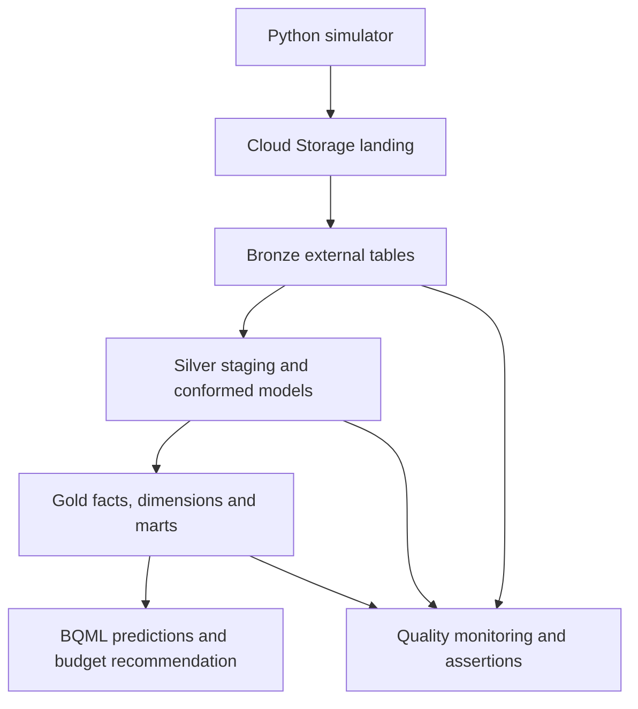

# Kloof Marketing Pipeline

A multi-source marketing pipeline built with Google Cloud Storage, BigQuery, Dataform, BigQuery ML and Gemini.

Kloof Outdoor is a fictional South African retailer. It spent about R1.5 million on Google and Meta ads. The platforms reported strong returns, but finance could not match those claims to real sales. The business also did not know which campaigns attracted customers who returned.

This project answers one question:

> Where should Kloof move next month's ad budget to win customers who will be worth the most over the next 90 days?

The simulator creates the source data. The pipeline lands it unchanged, cleans and joins it, predicts customer value, and compares campaign performance using real CRM revenue.

---

## Result

Platform ROAS alone gives the wrong budget signal.

| Campaign | Platform ROAS | Actual ROAS | Value-adjusted ROAS | Final rank |
|---|---:|---:|---:|---:|
| Google Search Brand | 8.01 | 5.11 | 9.33 | 1 |
| Google PMax All Products | 4.45 | 2.80 | 5.52 | 2 |
| Meta Retargeting | 12.24 | 4.50 | 4.61 | 3 |
| Meta Winter Sale | 4.95 | 2.16 | 3.21 | 5 |

Meta Winter Sale appears stronger than Google Shopping in the ad platforms: **4.95 versus 4.45**. After CRM revenue and predicted 90-day customer value are included, Google Shopping wins: **5.52 versus 3.21**.

The practical recommendation is to protect Google Brand and move marginal budget from Meta Winter Sale toward Google Shopping. The result comes from customer value, not platform claims.

Value-adjusted ROAS is:

```text
(first-order revenue + predicted 90-day value of new customers) / ad spend
```

---

## The data

The repository includes a seeded Python simulator. It creates about 180 days of linked marketing and commerce data:

- 4,900 customers
- 10,000 orders
- 700,000 GA4 events
- R1.5 million in ad spend
- Google Ads, Meta Ads, GA4, CRM, creative, weather and FX files

The files use CSV, JSON Lines, nested compressed JSON, text and PNG formats. Daily folders use `dt=YYYY-MM-DD` partitions.

The simulator also plants realistic problems. These include duplicate exports, late GA4 events, refund updates, malformed JSON, internal traffic, test orders, city variants, weekend FX gaps and missing customer emails. Each issue has a stable code from `DQ01` to `DQ12`.

Because the simulator owns the hidden truth, the pipeline can prove whether it detected each problem. Production models do not read that truth. Only the final grading scorecard may use it.

---

## The pipeline



| Layer | Purpose | Main outputs |
|---|---|---|
| Bronze | Preserve each source as delivered | Ten external tables with file and partition lineage |
| Silver | Parse, clean, deduplicate and join the sources | Customers, sessions, orders, attribution and creative features |
| Gold | Serve trusted business data | Star schema, customer features and campaign marts |
| ML | Predict 90-day customer value | BQML boosted-tree model, evaluation and predictions |
| Ops | Test and monitor the pipeline | Freshness, reconciliation, DQ results and scorecard |

All transformations run as SQL in BigQuery. Dataform controls dependencies and assertions. Gemini extracts tone, discount and call-to-action features from ad copy inside the warehouse.

### Key validated outputs

| Output | Result |
|---|---:|
| Genuine CRM orders | 10,033 |
| Conformed people | 4,841 |
| Valid web sessions | 243,536 |
| Customers scored by BQML | 4,628 |
| Campaign-week rows | 162 |
| Campaign driver rows | 486 |

Gold revenue, order count and ad spend reconcile to Silver. Raw PII stays in Bronze. Email and phone identifiers are normalised and hashed before they leave the secured CRM source.

---

## Repository

```text
README.md                         Project summary and setup
workflow_settings.yaml           Dataform project settings
simulator/
  sim/                            Seeded data generator
  scripts/                        Daily run and truth reports
  schemas/                        Bronze source schemas
  tests/                          Simulator tests
  DATA_DICTIONARY.md              Files, fields, grains and keys
  KNOWN_ISSUES.md                 SH01-SH11 and DQ01-DQ12
sql/
  bronze/                         External tables and CRM security
  setup/                          Gemini remote model setup
  silver/                         Silver validation queries
  gold/                           Gold, model and story validation
  quality/                        Freshness and DQ validation
definitions/
  sources/                        Bronze declarations
  seeds/                          City and internal-domain mappings
  staging/                        Source-specific Silver models
  intermediate/                   Identity, sessions and attribution
  gold/                           Facts, dimensions and marts
  ml/                             BQML training, evaluation and scoring
  quality/                        Assertions, monitoring and scorecard
proof/                            Saved test and validation results
```

Start with `proof/gold_campaign_story.json` for the campaign result. Read `simulator/KNOWN_ISSUES.md` for every planted data problem and its fix.

---

## Running it

You need a GCP project with billing enabled. Use the same `US` location for the bucket, BigQuery datasets, connection and Dataform repository.

Create these datasets:

```text
kloof_bronze
kloof_silver
kloof_gold
kloof_ops
kloof_truth
```

### 1. Generate the data

Run from `simulator/`:

```bash
python -m pip install -r requirements.txt
python -m sim backfill --end 2026-09-15
python -m pytest -q
python scripts/dq_report.py output/truth
python scripts/story_check.py output/truth
```

The test suite should report `27 passed`.

### 2. Upload the landing files

```bash
gcloud storage rsync \
  output/landing \
  gs://<project-id>-kloof-landing/landing \
  --recursive
```

Do not edit the files before upload. Bronze must preserve the source exactly.

### 3. Create Bronze

Update the project ID and bucket name in the SQL where required. Run these files in BigQuery:

```text
sql/bronze/create_external_tables.sql
sql/bronze/secure_crm_customers.sql
sql/setup/create_gemini_remote_model.sql
```

### 4. Run Dataform

Connect the repository to Dataform and compile `workflow_settings.yaml`. Run the actions with the pipeline service account. Dataform builds them in dependency order:

```text
Silver staging -> conformed models -> Gold star schema
-> BQML model and predictions -> final marts -> quality checks
```

Useful execution tags include:

| Tag | Purpose |
|---|---|
| `silver` | Build the Silver layer |
| `gold` | Build the Gold layer and ML outputs |
| `quality_batch1` | Run the twelve blocking DQ checks and reconciliation |
| `quality_freshness` | Check source delivery |
| `quality_monitoring` | Append the latest DQ detection counts |
| `quality_scorecard` | Compare detected issues with planted truth |

Load the simulator manifest into `kloof_truth.dq_manifest` only when you need the grading scorecard.

### 5. Add a new day

```bash
python -m sim daily
gcloud storage rsync \
  output/landing \
  gs://<project-id>-kloof-landing/landing \
  --recursive
```

Then run Dataform again. Incremental models reprocess recent data where late events or updates are expected.

---

## Quality controls

- Every Silver and Gold model declares key and null checks.
- Manual assertions prove that each `DQ01` to `DQ12` fix worked.
- GA4 reprocesses a three-day window and deduplicates event fingerprints.
- CRM is the source of truth for orders and revenue.
- Broken Meta records go to quarantine.
- Freshness checks distinguish daily sources from event-driven creative files.
- Gold order count, revenue and spend must reconcile to Silver.
- `ops_dq_results` records detected issues without reading planted truth.

The `proof/` folder contains the saved simulator tests, layer validations, model evaluation and campaign result.

---

## Notes and limitations

**The data is simulated.** It is designed to test engineering decisions and produce a known campaign story. It is not evidence about real customer behaviour.

**The model has modest predictive power.** The holdout R2 is `0.19`. The model is leakage-safe and operational, but more history and stronger features would improve it.

**The latest GA4 days are provisional.** Events may arrive up to three days late or be re-sent. The pipeline handles this with rolling reprocessing and stable fingerprints.

**Platform revenue is not authoritative.** Google and Meta claims remain useful for comparison, but CRM determines actual sales and campaign value.
